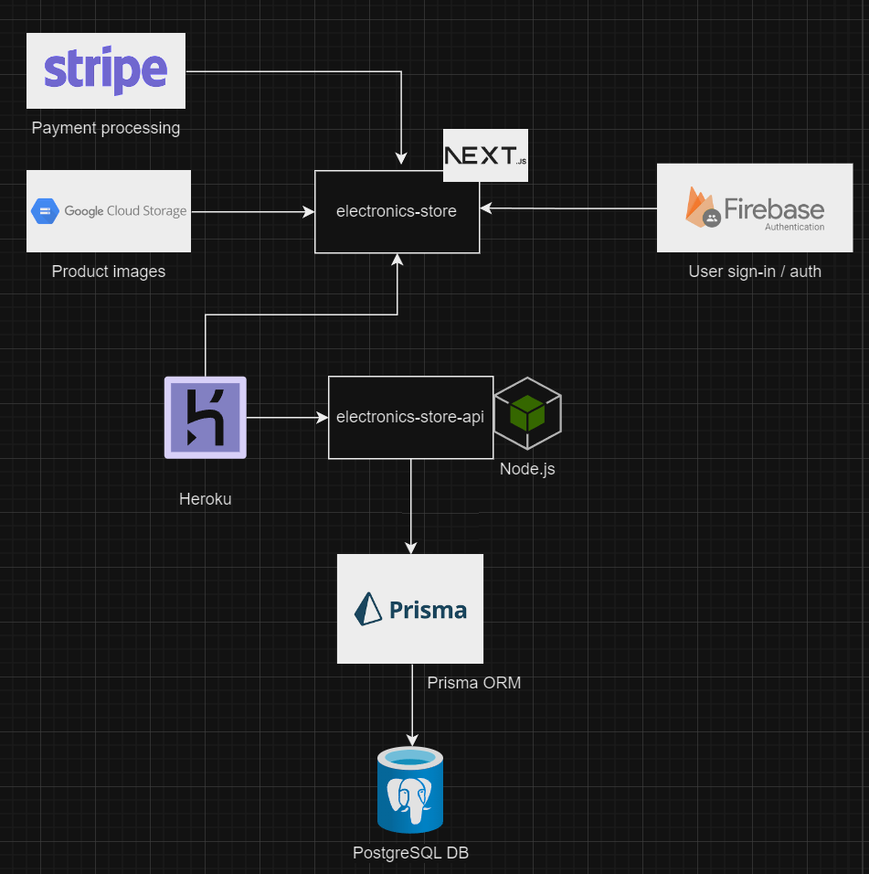
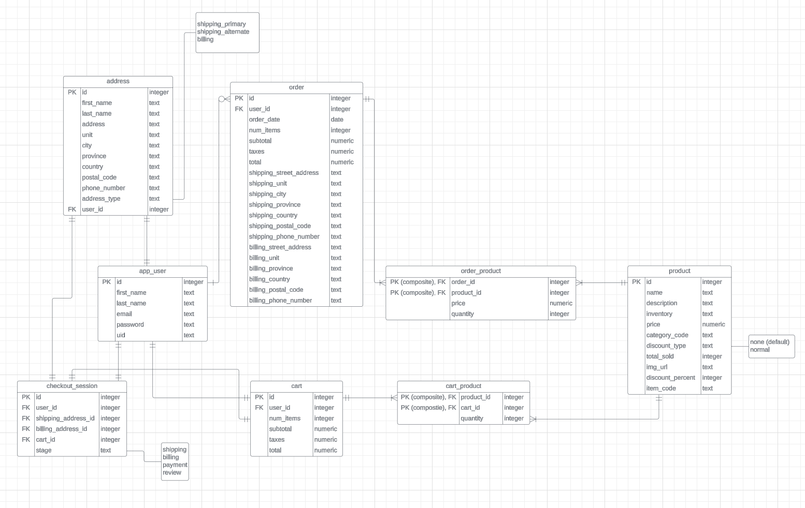

# The Electronics Store

The Electronics Store is a full-stack e-commerce project demonstrating skills in backend development, frontend development, and system architecture. 

**Live Demo:**

*   Application: https://electronics-store-8382b35f5fca.herokuapp.com/
*   Backend API (with Swagger UI): https://the-electronics-store-api-962f1726488d.herokuapp.com/api-docs/

## Project Overview

This project serves as a portfolio piece and a learning project, allowing me to apply my knowledge and skills in a practical setting. It demonstrates my ability to create a fully-functional, responsive e-commerce platform from scratch, including features such as user registration, login, product browsing, shopping cart, and checkout.

The site is a streamlined version of a typical online electronics or big box store, closer to a minimum viable product than a fully expanded retail experience. It features a focused product category selection with 40 products in the database.

Browsing is done via a shallow-nested navbar, with breadcrumbs on all product routes for easy navigation. The simplified structure facilitated easier implementation of features like the breadcrumb component.

## Technologies Used

### Database

*   Prisma ORM
*   PostgreSQL

### Backend

*   Node.js
*   Express.js
*   Firebase Admin SDK
*   Google Cloud Storage

### Frontend

*   Next.js
*   Stripe
*   Firebase Auth

### Styling

*   Tailwind CSS
*   DaisyUI
*   Material UI
*   Splide

## Features

### User Account

*   Add/Edit primary shipping info
*   Add/Edit billing info
*   Account deletion (with modal confirmation)
*   Order history

### Cart

*   Increase/decrease item quantity
*   Delete cart items
*   Persistent cart storage

### Checkout

*   4-step process (Shipping, Billing, Payment, Review)
*   Checkout session created and maintained throughout the process

### Browsing and Searching

*   Breadcrumbs on all product routes
*   Responsive navbar with shallow product hierarchy
*   Product cards with basic info

## Technical Documentation

The system architecture is decoupled, using third-party services to handle complex tasks like payment processing (Stripe), image storage (Google Cloud Storage), and authentication (Firebase).

The project consists of two separate applications:

*   **Backend:** Node.js with Express.js for routing, hosted on Heroku with PostgreSQL. Prisma is used for database access.
*   **Frontend:** Next.js utilizing App Router and server-side API fetching, also hosted on Heroku.

### Database Design

The database schema includes tables for addresses, users, checkout sessions, orders, carts, products, and join tables for many-to-many relationships. Design choices prioritize data integrity, ease of maintenance, and efficient query performance.

*   **address:** To handle multiple address types (primary shipping, alternate shipping, billing), a single table is used with an `address_type` field to differentiate.

*   **app_user:** Represents a typical user. The `uid` field corresponds to a Firebase Authentication-generated value, used alongside the table's `id` to track users across the frontend and backend.

*   **checkout_session:** Created when a user starts checkout. The `stage` field tracks their progress through the 4-step process.

*   **order:** Stores a snapshot of a purchase, including shipping and billing info at the time. This involves some redundancy to persist past order data.

*   **cart:** Each user is assigned a persistent cart upon registration, streamlining cart management and product tracking.

*   **cart_product:** A join/junction table handling the many-to-many relationship between `cart` and `product`.

*   **product:** Contains product details, including a `discount_type` field that can be expanded for various sale types (e.g., "countdown," "seasonal," "flash").

*   **order_product:** Another join/junction table managing the many-to-many relationship between `order` and `product`.

---

**Note:** A separate README will be provided for detailed backend API documentation, including route details and Swagger UI integration here: https://github.com/masoumim/the-electronics-store-api
